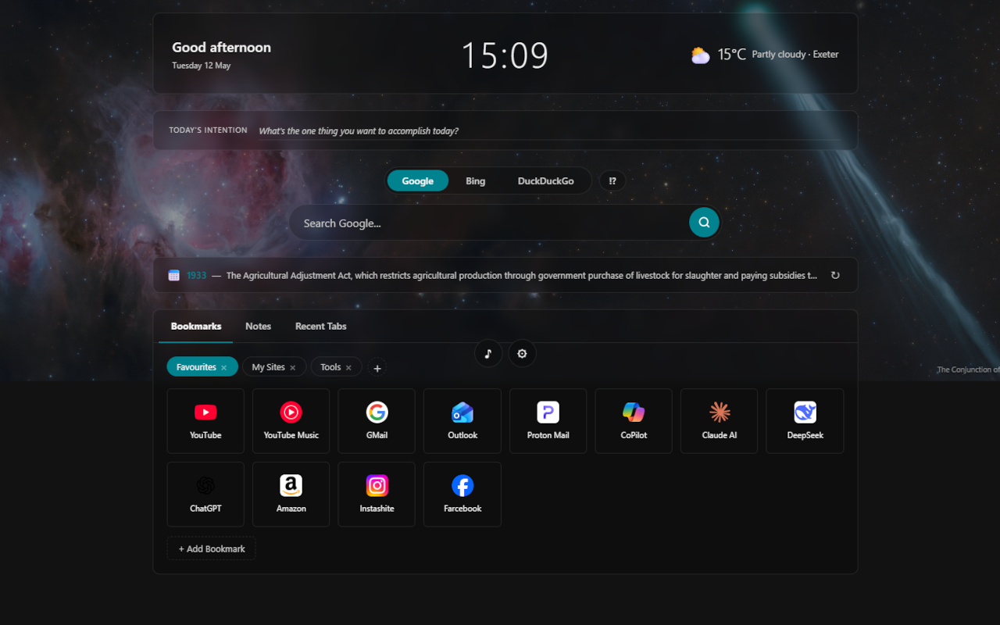
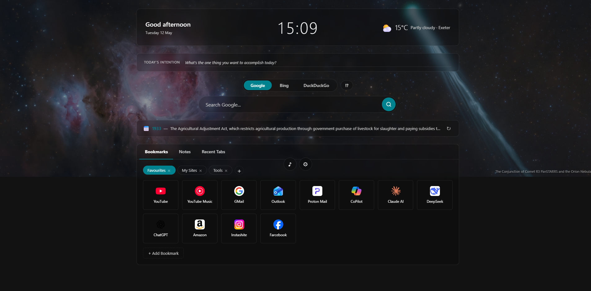
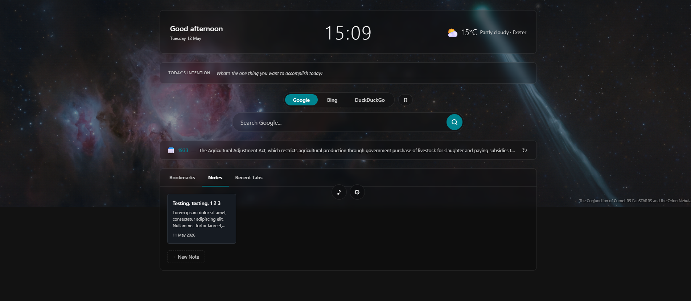
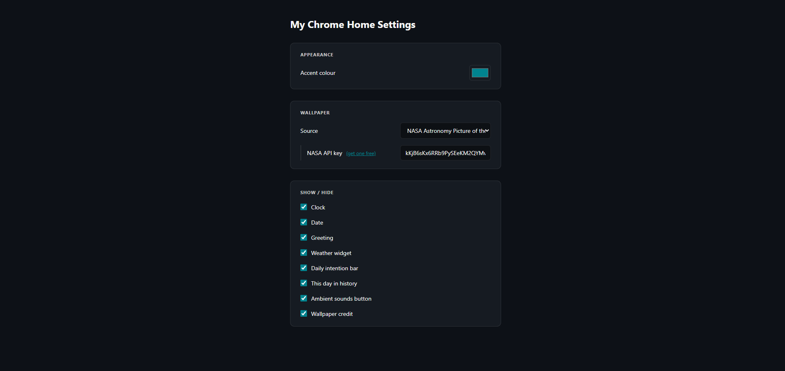
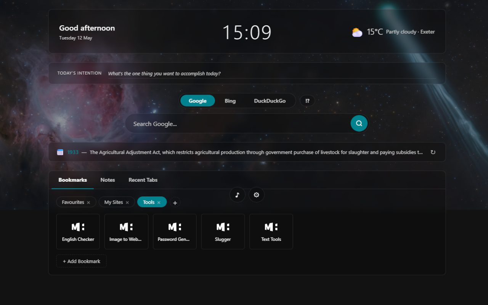

# My Chrome Home

A personalised Chrome new-tab page with a clean glass-morphism design. Replaces the default new tab with a dashboard that surfaces everything you need at a glance — without sending any data to third-party analytics services.



---

## Features

| Category | What's included |
|---|---|
| **Time & date** | Live clock and full date display |
| **Greeting** | Context-aware greeting (Good morning / afternoon / evening) |
| **Weather** | Current conditions + 3-day forecast via Open-Meteo (no API key required) |
| **Bookmarks** | Drag-and-drop bookmark manager built into the page |
| **Quick Note** | Toolbar popup for scratch-pad notes saved locally |
| **Daily intention** | Editable focus bar that persists through the day |
| **This day in history** | Random historical event from Wikipedia, with a ↻ cycle button |
| **Quote of the day** | Seeded-daily quote from a local library of 1 000+ quotes, filterable by category, with a ↻ cycle button |
| **Ambient sounds** | Rain / white-noise / café toggle generated by the Web Audio API (no audio files) |
| **Google Tasks** | View and tick off tasks from your Google account (requires OAuth setup) |
| **Wallpaper** | Bing Photo of the Day · NASA APOD · solid colour · custom image URL |
| **Theming** | Accent colour picker, boxed or full-width layout |
| **Show / hide** | Every widget can be individually toggled in Settings |

---

## Screenshots

| New tab | Bookmarks | Notes |
|---|---|---|
|  |  |  |

| Settings | NASA wallpaper |
|---|---|
|  |  |

---

## Installation

### From the Chrome Web Store

*Coming soon.*

### Load unpacked (developer mode)

1. Clone or download this repository.
2. Open Chrome and navigate to `chrome://extensions`.
3. Enable **Developer mode** (toggle in the top-right corner).
4. Click **Load unpacked** and select the project folder.
5. Open a new tab — you're done.

---

## Google Tasks setup (optional)

Google Tasks integration requires an OAuth 2.0 client ID from Google Cloud Console.

1. Go to [Google Cloud Console](https://console.cloud.google.com/) and create a project.
2. Enable the **Google Tasks API** for the project.
3. Under **APIs & Services → Credentials**, create an **OAuth 2.0 Client ID** of type *Chrome extension* and paste your extension ID (found on `chrome://extensions`).
4. Copy the generated client ID.
5. Open `manifest.json` and replace `YOUR_CLIENT_ID.apps.googleusercontent.com` in the `oauth2` block with your client ID.
6. Reload the extension on `chrome://extensions`.

Tasks appear automatically in the sidebar after you sign in to Chrome.

---

## Customisation

Open **Settings** from the gear icon (bottom-right of the new tab page) or via `chrome://extensions → My Chrome Home → Extension options`.

| Setting | Options |
|---|---|
| Accent colour | Any colour via colour picker |
| Layout width | Boxed (1 080 px) · Full width |
| Wallpaper source | Bing · NASA APOD · Solid colour · Custom URL |
| NASA API key | Optional — leave blank for the free `DEMO_KEY` |
| Quote category | All · Age · Business · Courage · Humorous · Inspirational · ... (63 categories) |
| Show / hide | Clock · Date · Greeting · Weather · Intention · History · Quotes · Sounds · Credit |

Settings sync across devices via `chrome.storage.sync` where quota allows, falling back to local storage automatically.

---

## Privacy

**No data is sent to the extension developer or any analytics service.**

| Data | Where it lives | Notes |
|---|---|---|
| Settings | `chrome.storage.sync` | Synced across your signed-in Chrome profiles |
| Bookmarks, notes, intention | `chrome.storage.local` | Device-only |
| Wallpaper cache | `chrome.storage.local` | Cleared automatically when wallpaper source changes |
| Google Tasks | Google's servers | Read via OAuth — only your own tasks, never stored locally |

Third-party network calls made by the extension:

| Service | Purpose | Privacy policy |
|---|---|---|
| [Open-Meteo](https://open-meteo.com/) | Weather data | [open-meteo.com/en/terms](https://open-meteo.com/en/terms) |
| [Nominatim / OpenStreetMap](https://nominatim.openstreetmap.org/) | Reverse geocoding (city name from coordinates) | [osmfoundation.org/wiki/Privacy_Policy](https://osmfoundation.org/wiki/Privacy_Policy) |
| [Bing](https://www.bing.com/) | Photo of the Day wallpaper | [Microsoft Privacy Statement](https://privacy.microsoft.com/en-us/privacystatement) |
| [NASA APOD](https://api.nasa.gov/) | Astronomy Picture of the Day wallpaper | [nasa.gov/privacy](https://www.nasa.gov/privacy/) |
| [Wikipedia](https://en.wikipedia.org/) | This day in history | [wikimediafoundation.org/privacy](https://wikimediafoundation.org/privacy/) |
| [Google Tasks API](https://developers.google.com/tasks) | Task list (if enabled) | [Google Privacy Policy](https://policies.google.com/privacy) |

The Quotes of the Day feature reads from a local JSON file bundled with the extension — no network call is made.

---

## Tech stack

- **Manifest V3** Chrome extension
- Vanilla JavaScript (no build step, no frameworks)
- CSS custom properties + glass-morphism (`backdrop-filter: blur`)
- Web Audio API for ambient sound synthesis
- HTML5 Drag and Drop API for bookmark reordering
- `chrome.storage.sync` / `chrome.storage.local`
- `chrome.identity` for Google OAuth 2.0

---

## Project structure

```
my-chrome-home/
├── manifest.json
├── newtab.html          # New tab page
├── options.html         # Settings page
├── popup.html           # Quick Note toolbar popup
├── quotes.json          # Local quote library (1 000+ quotes, tagged by category)
├── quotes-categories.array
├── css/
│   ├── main.css         # New tab styles
│   ├── options.css      # Settings styles
│   └── popup.css        # Popup styles
├── js/
│   ├── app.js           # New tab logic (weather, history, quotes, sounds, …)
│   ├── options.js       # Settings page logic
│   └── popup.js         # Quick Note logic
└── icons/
    ├── icon16.png
    ├── icon48.png
    └── icon128.png
```

---

## Author

**Mark Hall** — [markhall.dev](https://markhall.dev/my-chrome-home/)

---

## License

MIT — see [LICENSE](LICENSE) for details.
